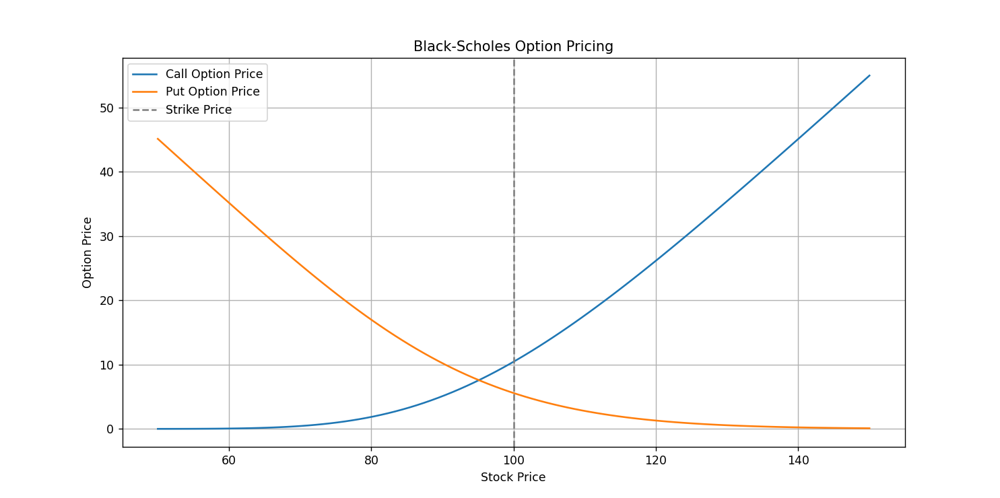

# Black-Scholes Option Pricing Model

Ce projet implémente le modèle de Black-Scholes pour calculer les prix des options européennes de type call et put. Il vise à fournir une démonstration pratique de la modélisation des options et à faciliter la compréhension des concepts clés liés aux marchés financiers.

## Fonctionnalités

- **Calcul du prix d'une option call européenne**.
- **Calcul du prix d'une option put européenne**.
- **Visualisation des prix des options** en fonction du prix de l'action.
- **Support de plusieurs paramètres** :
  - Prix de l’action actuelle.
  - Prix d’exercice.
  - Temps jusqu’à l’échéance.
  - Taux d’intérêt sans risque.
  - Volatilité de l’action.

## Installation

1. **Cloner le dépôt GitHub** :
   ```bash
   git clone https://github.com/Andromede75/black-scholes-option-pricing.git
   cd black-scholes-option-pricing
   ```

2. **Créer un environnement virtuel (recommandé)** :
   ```bash
   python -m venv env
   source env/bin/activate  # Sur Linux/Mac
   env\Scripts\activate  # Sur Windows
   ```

3. **Installer les dépendances** :
   ```bash
   pip install -r requirements.txt
   ```

## Utilisation

Exécuter le script principal :
```bash
python "Black Scholes Option Pricing.py"
```
Lors de l'exécution, le script :
1. Affiche les prix des options call et put dans la console.
2. Génère des graphiques montrant l’évolution des prix des options en fonction du prix de l’action.

## Exemples de résultats

### Résultats affichés dans la console

```
Black-Scholes Call Option Price: 10.45
Black-Scholes Put Option Price: 5.57
```

### Graphique généré



## Explications techniques

Le modèle de Black-Scholes repose sur les hypothèses suivantes :
- Le marché est frictionless (pas de coûts de transaction ni de taxes).
- Il est possible de vendre à découvert sans restriction.
- Il n’y a pas de paiements de dividendes pendant la durée de vie de l’option.
- Le taux d’intérêt sans risque et la volatilité sont constants.

Les formules utilisées pour les options européennes de type call et put sont les suivantes :

### Formule pour une option call
\[
C = S N(d_1) - K e^{-rT} N(d_2)
\]
Où :
\[
d_1 = \frac{\ln\left(\frac{S}{K}\right) + \left(r + \frac{\sigma^2}{2}\right) T}{\sigma \sqrt{T}}, \quad d_2 = d_1 - \sigma \sqrt{T}
\]

### Formule pour une option put
\[
P = K e^{-rT} N(-d_2) - S N(-d_1)
\]

## Améliorations possibles

- Ajout du calcul des **Greeks** : Delta, Gamma, Theta, Vega, Rho.
- Support des options américaines (via des méthodes numériques comme les arbres binomiaux).
- Interface utilisateur interactive avec **Streamlit**.

## Auteurs

- **Andromede75** – [GitHub](https://github.com/Andromede75)

## Licence

Ce projet est sous licence MIT - voir le fichier [LICENSE](LICENSE) pour plus de détails.

## Références

- [Documentation officielle de NumPy](https://numpy.org/doc/)
- [Documentation officielle de SciPy](https://docs.scipy.org/doc/)
- [Black-Scholes Model - Investopedia](https://www.investopedia.com/terms/b/blackscholes.asp)

